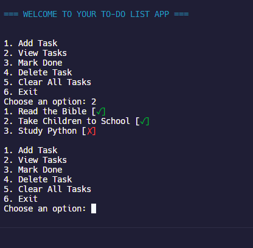

## 📝 Python To-Do List App

This is a terminal-based To-Do List app built in Python. It allows users to manage tasks directly from the command line. Data is saved to a file (`tasks.txt`), so progress is preserved between runs.

---

## 🚀 Features

- ✅ Add tasks
- ❌ Delete tasks
- ✔️ Mark tasks as done (multiple supported)
- 🧹 Clear all tasks
- 📂 Save and load tasks automatically
- 🎨 Colorful output using `colorama`

---

## 📸 Screenshot



---

## 🧪 How to Run the App

1. Make sure Python is installed on your machine.
2. Install the required package:
   ```bash
   pip install colorama
   python main.py

---

## 🧑‍💻 Author

Eric Mutisya  
Python Developer | Task Automation & Simple Tools  

GitHub Profile: https://github.com/Ek-Coder-Tech

Upwork Profile: https://www.upwork.com/freelancers/~012558bab6232e8e65

---

## 📌 Notes

This is part of my journey to build real, useful Python tools and contribute to solving small business and personal productivity challenges using code. Feedback is welcome!
